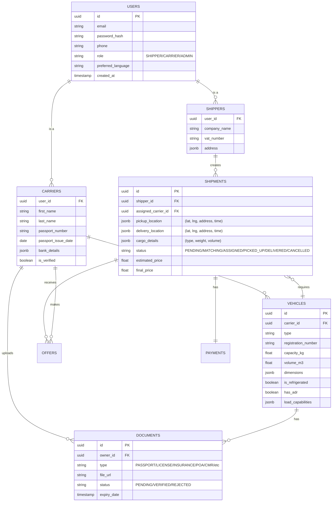

# AI-Powered Logistics Platform - Technical Specification

## 1. High-Level Architecture

### 1.1 Technology Stack

**Frontend:**
*   **Framework:** Next.js (React) - App Router
*   **Language:** TypeScript
*   **Styling:** TailwindCSS
*   **State Management:** React Context + Hooks (or Zustand/TanStack Query)
*   **Maps:** Leaflet or MapLibre (using OpenStreetMap tiles) - **Free**
*   **Internationalization:** `next-intl` or `react-i18next` (EN, DE, GE, RU)

**Backend:**
*   **Core API:** Node.js with Nest.js (Modular Monolith or Microservices)
*   **Language:** TypeScript
*   **AI Services:** Python (FastAPI) or Node.js (if using JS-based AI libs), communicating via gRPC or HTTP
*   **Real-time:** Socket.io (integrated with Nest.js)

**Database & Storage:**
*   **Primary DB:** PostgreSQL (Self-hosted via Docker or Supabase Free Tier)
*   **Caching:** Redis (Self-hosted via Docker or Upstash Free Tier)
*   **File Storage:** MinIO (Self-hosted S3 compatible) or Supabase Storage (Free Tier)

**DevOps:**
*   **Containerization:** Docker
*   **Orchestration:** Docker Compose (Dev), Kubernetes or ECS (Prod)
*   **CI/CD:** GitHub Actions

### 1.2 Architecture Diagram (Mermaid)

```mermaid
graph TD
    subgraph "Client Layer"
        Web[Web App (Next.js)]
        Mobile[Mobile Web / PWA]
    end

    subgraph "Load Balancer / API Gateway"
        Nginx[Nginx / Cloud Load Balancer]
    end

    subgraph "Backend Services (Nest.js)"
        Auth[Auth Service]
        Core[Core Logistics Service]
        Payment[Payment Service]
        Notif[Notification Service]
    end

    subgraph "AI Services (Python/Node)"
        Match[Matching Engine]
        Route[Route Optimization]
        Price[Price Prediction]
    end

    subgraph "Data Layer"
        DB[(PostgreSQL + PostGIS)]
        Redis[(Redis Cache)]
        S3[Object Storage (S3/R2)]
    end

    Web --> Nginx
    Mobile --> Nginx
    Nginx --> Auth
    Nginx --> Core
    Nginx --> Payment
    
    Core --> DB
    Core --> Redis
    Core --> S3
    Core --> Notif
    
    Core -- gRPC/HTTP --> Match
    Core -- gRPC/HTTP --> Route
    Core -- gRPC/HTTP --> Price
    
    Match --> DB
    Route --> DB
    Price --> DB
```

---

## 2. Database Schema

### 2.1 ERD Overview (Mermaid)



### 2.2 Table Definitions

#### `users`
| Column | Type | Description |
|---|---|---|
| `id` | UUID | Primary Key |
| `email` | VARCHAR | Unique, Indexed |
| `phone` | VARCHAR | Unique |
| `password_hash` | VARCHAR | Bcrypt/Argon2 hash |
| `role` | ENUM | 'SHIPPER', 'CARRIER', 'ADMIN' |
| `language` | VARCHAR | 'en', 'de', 'ge', 'ru' |
| `is_active` | BOOLEAN | Account status |
| `created_at` | TIMESTAMP | |

#### `carriers`
| Column | Type | Description |
|---|---|---|
| `user_id` | UUID | FK -> users.id |
| `first_name` | VARCHAR | |
| `last_name` | VARCHAR | |
| `passport_number` | VARCHAR | |
| `passport_issue_date` | DATE | |
| `bank_name` | VARCHAR | |
| `bank_iban` | VARCHAR | |
| `bank_swift` | VARCHAR | |
| `address` | JSONB | Structured address |
| `verification_status` | ENUM | 'PENDING', 'VERIFIED', 'REJECTED' |

#### `vehicles`
| Column | Type | Description |
|---|---|---|
| `id` | UUID | Primary Key |
| `carrier_id` | UUID | FK -> carriers.user_id |
| `type` | ENUM | 'VAN', 'TRUCK', 'TRAILER', etc. |
| `plate_number` | VARCHAR | |
| `capacity_kg` | DECIMAL | |
| `volume_m3` | DECIMAL | |
| `length_m` | DECIMAL | |
| `width_m` | DECIMAL | |
| `height_m` | DECIMAL | |
| `is_refrigerated` | BOOLEAN | |
| `adr_class` | VARCHAR | Nullable |
| `features` | JSONB | ['LIFTGATE', 'CURTAIN', ...] |

#### `documents`
| Column | Type | Description |
|---|---|---|
| `id` | UUID | Primary Key |
| `owner_id` | UUID | FK -> users.id (Carrier) or vehicles.id |
| `type` | ENUM | 'PASSPORT', 'LICENSE', 'INSURANCE', 'POA', 'CMR', 'OTHER' |
| `file_url` | VARCHAR | S3/MinIO URL |
| `status` | ENUM | 'PENDING', 'VERIFIED', 'REJECTED' |
| `expiry_date` | DATE | Nullable |
| `metadata` | JSONB | Extra info (Issue date, etc.) |

#### `shipments`
| Column | Type | Description |
|---|---|---|
| `id` | UUID | Primary Key |
| `shipper_id` | UUID | FK -> shippers.user_id |
| `carrier_id` | UUID | FK -> carriers.user_id (Nullable) |
| `pickup_lat` | FLOAT | |
| `pickup_lng` | FLOAT | |
| `pickup_address` | TEXT | |
| `pickup_time` | TIMESTAMP | |
| `delivery_lat` | FLOAT | |
| `delivery_lng` | FLOAT | |
| `delivery_address` | TEXT | |
| `delivery_time` | TIMESTAMP | |
| `cargo_type` | VARCHAR | |
| `weight_kg` | DECIMAL | |
| `status` | ENUM | 'OPEN', 'OFFERED', 'IN_TRANSIT', 'DELIVERED' |
| `price` | DECIMAL | |

---

## 3. API Endpoint Specification

### 3.1 Authentication (`/api/auth`)
*   `POST /register/shipper`: Register new shipper
*   `POST /register/carrier`: Register new carrier (with initial doc upload URLs)
*   `POST /login`: JWT Login
*   `POST /refresh`: Refresh Access Token
*   `GET /me`: Get current user profile

### 3.2 Shipments (`/api/shipments`)
*   `POST /`: Create a new shipment (Shipper)
*   `GET /`: List shipments (Filter by status, role)
*   `GET /:id`: Get details
*   `PATCH /:id/status`: Update status (Carrier: Loaded, Delivered, etc.)
*   `POST /:id/offer`: Make an offer (Carrier)
*   `POST /:id/accept-offer`: Accept carrier offer (Shipper)

### 3.3 Vehicles (`/api/vehicles`)
*   `POST /`: Add vehicle
*   `GET /`: List my vehicles
*   `PUT /:id`: Update vehicle
*   `DELETE /:id`: Remove vehicle

### 3.4 Documents (`/api/documents`)
*   `POST /upload-url`: Get presigned URL for S3 upload
*   `POST /verify`: Submit document for verification (Admin/AI)

### 3.5 AI & Matching (`/api/ai`)
*   `POST /estimate-price`: Get price range for shipment parameters
*   `GET /matches`: Get matched shipments for a carrier (or carriers for a shipment)
*   `POST /optimize-route`: Calculate optimal route for multiple stops

---

## 4. AI Logic & Algorithms

### 4.1 AI Matching Engine
**Inputs:**
*   Shipment: Origin, Destination, Weight, Volume, Type, Dates.
*   Carrier: Current Location (Real-time), Vehicle Type, Capacity, Home Base, Historical Routes.

**Logic:**
1.  **Filtering:** Eliminate carriers with incompatible vehicles or unavailable schedules.
2.  **Scoring:**
    *   Distance Score: How close is the carrier to pickup?
    *   Route Score: Does this fit their usual lanes or backhaul (return trip)?
    *   Rating Score: Carrier performance history.
3.  **Ranking:** Sort carriers by total score.
4.  **Notification:** Push notification to top 5 matches first.

### 4.2 Route Optimization
**Inputs:** List of pickup/delivery points.
**Logic:**
1.  Use GraphHopper or OSRM (Open Source Routing Machine) for distance matrix and routing - **Free/Self-hosted**.
2.  Solve TSP (Traveling Salesman Problem) or VRP (Vehicle Routing Problem) constraints (time windows).
3.  Factor in traffic data and border crossing delays (historical data).

### 4.3 Price Estimation
**Model:** Regression Model (Random Forest or Gradient Boosting).
**Features:**
*   Distance (km)
*   Weight/Volume
*   Vehicle Type
*   Fuel Prices (Current)
*   Seasonality (Month/Week)
*   Route Popularity (Demand/Supply ratio on this lane)

---

## 5. UX/UI Structure

### 5.1 Folder Structure (Next.js App Router)

```
/src
  /app
    /[locale]              # i18n dynamic route (en, de, ge, ru)
      /auth
        /login
        /register
      /dashboard
        /shipper
          /create-shipment
          /tracking
        /carrier
          /jobs
          /my-vehicles
          /earnings
      /profile
      /layout.tsx          # Main layout with Lang Switcher
      /page.tsx            # Landing Page
  /components
    /ui                    # Reusable UI (Buttons, Inputs)
    /forms                 # Complex forms (Shipment, Vehicle)
    /maps                  # Map components
  /lib
    /api                   # API clients
    /utils                 # Helpers
  /messages                # i18n JSON files (en.json, etc.)
```

### 5.2 Wireframe Descriptions

**1. Carrier Registration Wizard**
*   **Step 1:** Personal Info (Name, Phone).
*   **Step 2:** Vehicle Details (Type, Dims).
*   **Step 3:** Document Upload (Drag & Drop zone for License, Insurance).
*   **Step 4:** Bank Details.
*   **Success:** "Profile under review" dashboard.

**2. Shipper - Create Shipment**
*   **Left Panel:** Form.
    *   "Where from?" (OpenStreetMap Nominatim / Photon Geocoder).
    *   "Where to?"
    *   "What are we moving?" (Pallets, Box, Machine).
    *   "Vehicle needed?" (Selector with icons).
*   **Right Panel:** Live Map.
    *   Shows route polyline.
    *   Shows "Estimated Price: €450 - €500".
*   **Bottom:** "Post Shipment" button.

**3. Carrier - Job Board**
*   **Filter Bar:** "Near me", "To Home", "High Price".
*   **List Cards:**
    *   Route visual (A -> B).
    *   Price (Green bold text).
    *   Cargo info (24t, Curtain).
    *   "Accept" or "Bid" buttons.

---

## 6. Implementation Steps

1.  **Setup:** Initialize Next.js repo with TypeScript, Tailwind, and i18n.
2.  **Backend Core:** Setup Nest.js, DB connection, and Auth.
3.  **Database:** Run migrations for Users, Vehicles, Shipments.
4.  **Frontend Auth:** Build Login/Register screens.
5.  **Vehicle Module:** Carrier vehicle management (CRUD).
6.  **Shipment Module:** Create and List shipments.
7.  **AI Integration:** Connect Python service for matching/pricing.
8.  **Real-time:** Implement Socket.io for status updates.
9.  **Testing:** E2E tests with Playwright.
